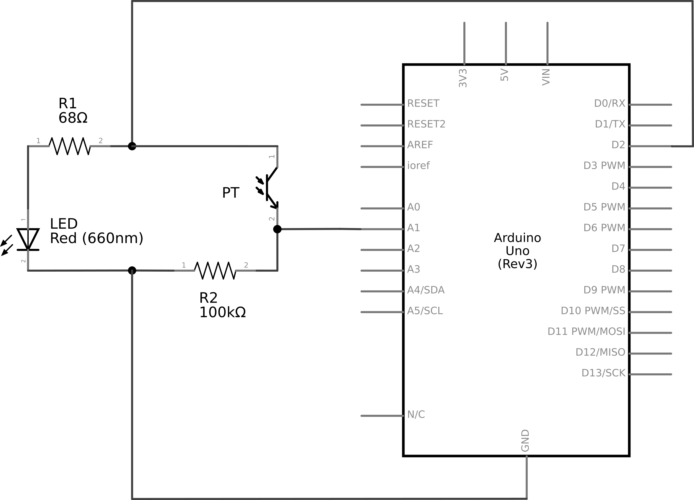
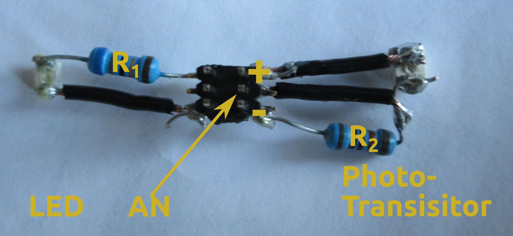
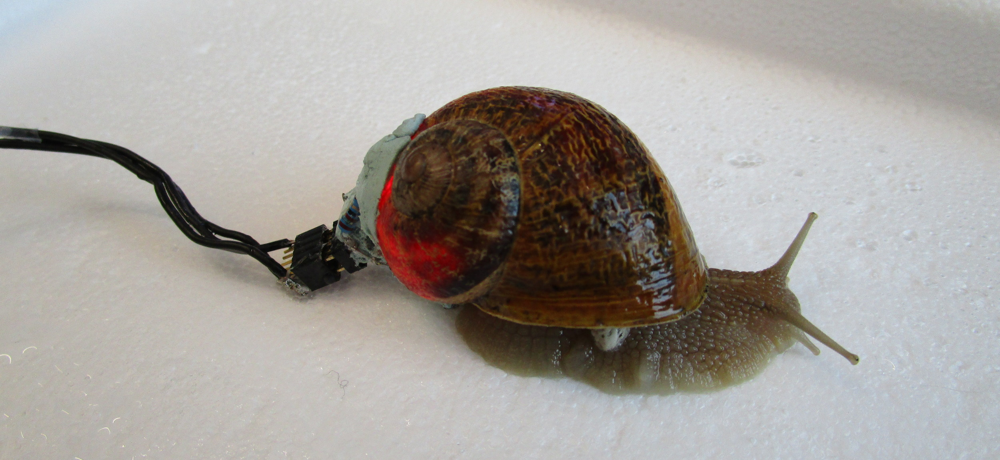
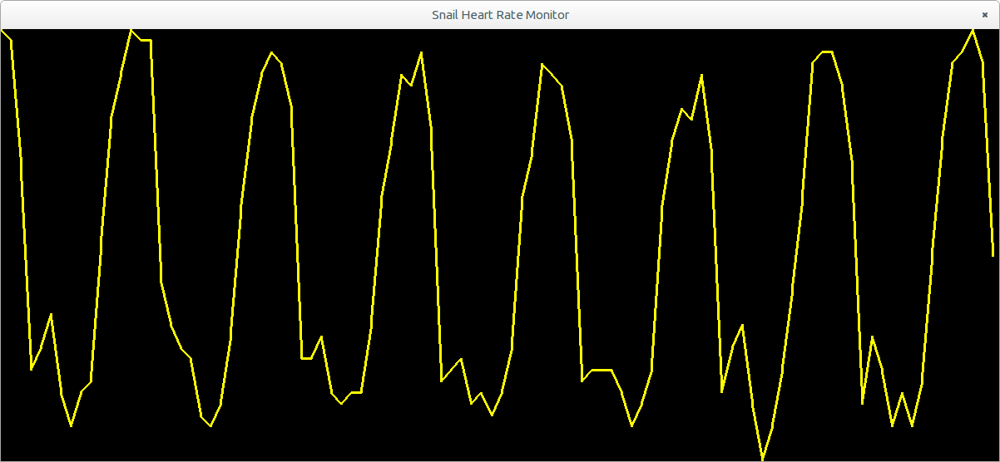

Optical Snail Heart Rate Monitor
==================================

Monitoring physiological variables is crucial in many areas of biology.
It is particularly challenging to monitor physiology of small 
animals whilst minimising experimental interference, or ideally, under natural conditions.

Land snails are remarkable animals for their ability to 
enter in dormancy states when the weather becomes too cold (hibernation) or too dry (estivation). 
They can remain several months in these respective states as there 
metabolism dramatically slows down, which reduces their need for food and water.

Recording heart rate of snails could reveal a valuable tool to shed light on the mechanisms 
underlying these exceptional phenomena. In addition, it could help understanding temporal patterns 
of activity and, for instance, foraging and mating strategies.

Garden snails (*Helix aspersa*) are fairly large terrestrial invertebrates (more than 10g for adult)
capable of pulling their own weight several times.
In addition, their shell is stable mineral support where small circuit can simply be glued with, 
presumably, little inconvenience for the snail.
It is possible to observe the heart of young snails, through their thin shell, by eye.
In adult snails, the same observation can be achieved by casting strong light through the shell.
It should therefore be possible to measure light attenuation over time in order to infer heart rate.     

For these reasons, land snails appear particularly suited to carrying small
electronic equipment in order to record an important physiological variable.
This project describes an inexpensive and non-invasive device to monitor heart rate in land snails.


Project Aim
--------------------
The aim of this project is to build a small device that can monitor a snail's heart rate and is small enough to be carried by a garden snail (*Helix aspersa*).
When sending red light though the bottom of the shell, the moving heart of the snail can be seen.
From this observation, the goal is to fit a low power red LED on one side of the shell whilst recording the intensity of the transmitted light, using a phototransistor, from the other side.

In order to keep the device lightweight, thin wires will be used to convey analogue signal between the animal an Arduino Uno board.
Then, the serial port will be used to communicate data to a computer which will display the signal in real time using an `python` script.

In order to save energy and reduce the amount of heat generated by the LED, the circuit will be powered only shortly before recording data points, and turned off immediately after. 
For this purpose, a digital pin of the Arduino will be used.

Technique Used
-----------------------

* Reading values from a phototransistor
* Using a digital pin to drive power
* Oversampling signal to improve resolution of A/D conversion.
* Real time data visualisation using `python` in combination with `pyserial` and `pygame`

Materials
--------------------

* Arduino Uno
* Computer
* Low voltage (around 3V) bright red LED. Ideally, a small surface mounted one with a flat lens and a wide (>100°) angle.
* Phototransistor (PT) that matches the wavelenght of the above LED.
* 68Ω resistor
* 100kΩ resistor
* A two rows, straight PCB header
* A one row PCB socket
* Some thin wire
* Large garden snail
* Superglue
* Blu tack
* A large snail (An adult *Helix aspersa* should be perfect)

**@edwbaker -> you will probably want to change the links to your cloned/reorganised version here**

**@edwbaker -> Maybe you want this as a foot note, or not at all.**

*The commercial references to some of the electronic components can be found at (https://github.com/gilestrolab/snail_back_pack/blob/master/protocols/rs_numbers.md)*

Code Download
-------------------------------
**@edwbaker -> fix links at some point**

* Arduino code (https://github.com/gilestrolab/snail_back_pack/blob/master/arduino_prototypes/sparse_phototransistor/sparse_phototransistor.ino)
* Python code (https://github.com/gilestrolab/snail_back_pack/blob/master/scripts/serial_monitor.py)

Supporting Materials
-----------------------
* Video of the protocol (http://dx.doi.org/10.6084/m9.figshare.1294198)

Theory
-------------------

Land snails have a semi-closed circular system where their oxygenated blood (hemolymph) is carried from their lung to the heart
in a pulmonary vein. Then, the heart, which has two cavities, a an atrium and a ventricle, pumps the blood into the aorta artery.
As opposed to a closed circulatory system (e.g. vertebrates), the hemolymph then mixes with the extracellular fluid.

The heart rates of snails is regulated by oxygen demand and can scale from more to 1 beat per second (e.g. when the animal is active and the temperature is high) to as low as one a minute (e.g. during hibernation).
Much like in vertebrates, the electrical activity of the heart can be recorded with electrocardiography (ECG) in order to infer heart rate.
However, this technique is quite invasive (i.e. holes need to be drilled in the shell), and technically challenging. 

In human, pulseoximetry can be used to reliably and non-invasively infer heart rate using red and infrared light.
Since a difference in light absorbance is visible during heart beats, it should be possible to record these variations using simple electronics. 

Light-Emitting Diodes (LEDs) are used in a wide range of applications.
They feature low power consumptions and some of them are capable of generating a relatively sharp narrow emission spectrum (e.g. 95% of the emission within a 100nm band).
In this project, we will power an LED wit a forward current (`I_F = 40mA`) with a forward voltage (`V_F = 2.6V`) from a `V_B = 5V` board. 
Therefore, we need to drop `V_R = V_B - V_F 2.4V` with a resistor (in series with the LED).

**@edwbaker => maths formatting around here?**

So the resistance `R = V_R/I_V`. So, in our case, `R = 60Ω`, which means we should be able to use a 68Ω resistor.

Phototransistors (PTs) are essentially transistors that allow variable current to pass though according to light intensity.
As opposed to photoresistors, they have a relatively fast response time. 
In order to record light intensity, we can record how much current "leaks" through the PT.
In order to do that we can put a resistor in series with the PT, and measure the voltage across it, using an analogue pin.
The value of the resistance affect the gain and will depend on the type of light and snail used. In most cases, a 100kΩ resistor will give a satisfying range of results.  


The circuit
----------------------
The circuit in itself is really simple:


Note that the **digital pin 2 is used instead of the 5v pin**. 
This way, we can turn the circuit on and off from the Arduino.


Putting it Together
----------------------
The end goal is to build a sort of saddle that can be glued onto the shell, and then plugged to a wire for recording purposes.
View from the bottom, the final product could look like this:


And from the top:


In both figures, '`AN`' is for the analogue pin.


General Instructions
-----------------------
 
We will use the leads of the resistors, and some wire, as a skeleton for our device.
Therefore, we will wait until the end to cut them.
Soldering the LED and the phototransistor can reveal challenging as both parts are very small.
So, it is recommended to hold them firmly, for instance, using "helping hands".
It is easy to forget that both **LED and PT should face downward** as the light will be transmitted through the shell. 


The LED
--------------

1. Before starting, ensure you can tell cathode and anode of the LED apart. Most "surface mounted LEDs" will have an indication such as a small chip on the `+` side.
2. Solder directly one lead of the 68Ω resistor to the anode of the LED.
3. Cut a short wire (1cm), strip and twist its tip.
4. Solder one extremity of the wire to the cathode.


The Phototransistor (PT)
---------------------------

1. As for the LED, ensure you know the polarity.
2. Cut two short wires (1cm), strip and twist there tips.
3. Solder one extremity of a wire to the anode of the PT.
4. Solder directly one lead of the 100kΩ resistor to the cathode. Leave some space between the anode and the resistor to solder the second wire.
5. Solder the tip of the second wire onto the lead of the resistor; between the resistor and the PT.


Assembling on the PCB header
--------------------------------------------------

1. We cut the PCB headed to leave only tree columns (i.e. 6pins). From a bottom-up view, let us label the pins:

```
A ---  -  --- D
B ---     --- E
C ---  +  --- F
```


2. Solder the wire connected to the LED light on A. That is on the `-` side.
3. Solder the lead of the resistor connected to the LED on C **and F** (i.e. `+` side).
4. Solder the wire connected the anode of the PT to F.
5. Solder the leg of the resistor connected to the PT on A **and D**.
6. Solder the second wire of the PT on E.

Lead
--------------------------------------------------

1. Strip the tips of three long (>30cm) flexible and thin wires.
2. Cut three columns of the PCB socket.
3. Solder each wire to a different pin of the PCB header.
4. Plug the PCB socket on the pins `D`, `E` and `F` of the PCB header.
5. Unsure you can tell which wire is for ground (pin `D`) and and which is for `+` (`F`).

Arduino
-------------------

1. Plug the `+` wire on digital pin 2 — or 5v if you want constant light (see 'Fitting the Circuit' section below).
2. Plug the ground wire on ground.
3. Plug the middle wire on analogue in 1.
4. Compile and upload the code for this project to the Arduino.
5. The LED light should start blinking quickly.

Fitting the Circuit
--------------------------------------------------

This is probably the hardest part of the process.
For this reason, a 4min online video demonstrating this part of the protocol step by step is available online (see 'Supporting Material' section above).

The main steps are:

1. Protect the animal by putting tissue paper on the opening of the shell.
2. Plug the Arduino to the USB port of your computer.
3. Run the `python` program (see 'Code Download' section above). A window should appear and plot the signal in real time (see section '???' below).
4. Plug the circuit on. *Use the 5v pin* instead of the digital pin as it will allow you to see the heart beat much better.
5. At this stage, you should be able to test the circuit by moving objects between PT and LED, and observe variation in the data displayed by the `python` program. 
4. Move the LED on the shell until you see the beating heart.
5. Use blu tac to maintain the circuit on the shell and assess the quality of the signal displayed on your screen.
6. When the signal is satisfying (sharp oscillations of large amplitude), glue PT and LED to the shell.
7. Unplug the circuit, interrupt the `python` program, and wait for the glue to dry.
8. Plug the circuit. This time, **use the analogue pin** as opposed to the 5v.
9. Run the `python` program. In addition to simply display heart rate, the data can be saved to a text file using the `--out` option  (see section 'Python Code Complementary' below).  

In the end, the fitted device on the animal could look like this:



**Important Notes:**

* Use as little glue as possible and avoid touching the foot of the animal with any glue. If you are concerns about toxicity, you may consider alternatives such as dental cement.
* In the video, the PT is close to the heart whilst the LED is on the opposite side. However, the invert setting also works, and may give more reliable result for long term monitoring.
 
Arduino Code Complementary 
----------------------------

This project only contains a short file.
We start by defining numerical constants:

* Every data point will be the sum of `OVER_SAMPLING` consecutive reads
* The sampling frequency `FS` (in Hz). That is the actual number of point we output every second
* `RISE_TIME` defines how long should we leave the circuit turned on  before reading any value
* The digital pin controlling power is number 2
* The analogue pin from which phototransistor values are read is number 1

```C++
#define OVER_SAMPLING 16
#define FS 5.0
#define RISE_TIME 1// ms
#define POWER_PIN 2
#define PHOTO_TRANSISTOR_PIN 1
```


// We define the time to sleep between actual reads (i.e. accounting for oversampling)
// as 1/ (Fse), where Fse is the actual sampling frequency, which is simply (FS x OVER_SAMPLING)
// Importantly, FS is in Hz(s^-1), whilst `delay()`expect ms, so we multiply the above expression by 1e3 (i.e. 1000)
// In addition, we already ask the device to sleep (RISE_TIME ms) before reading values, so we subtract this value
// Finally, since this value is not going to change during execution of the program,
// we can define it as a constant (const)
We are performing *oversampling* that is every data point we output is, in fact, the sum of several (exactly 16 in this example) reads.
Therefore, the actual reading sampling frequency `Fs_a = Fs * a` where `Fs` is the resulting sampling frequency (i.e. 5) and `a`, the resulting sampling frequency (5.0Hz).
The delay `dt` between two actual reads is simply `1/Fs_a` (in seconds).
Therefore, we can express the number of miliseconds to sleep as:
```C++
const float time_to_sleep_ms = 1e3/(FS*OVER_SAMPLING) - RISE_TIME;
```
Note that we also subtract the rise time to be more accurate.

In the setup, we just:

* set the baud rate to 57600 which should be more than enough
* set the digital pin as an output pin that can take HIGH(5v) or LOW(0v) values
```C++
void setup(void) {
	Serial.begin(57600);
	pinMode(POWER_PIN, OUTPUT);
}
```

Then, in every iteration of the main loop:

* We initialise an accumulator variable to 0.
* We are going to sample as many time as the value of `OVER_SAMPLING`, so we start a for loop in which we:
    * Turn the circuit ON
    * Wait for the circuit to be in a stationary state
    * read the phototransistor value
    * We increment the accumulator by the obtain value
    * We immediately turn the circuit OFF
    * We sleep for the delay `dt`
* When the obove loop completes, we can send the value of the accumulator to the serial port in order to use it from a connected computer

```C++
void loop(void) {
    unsigned int accum = 0;
	for(int i =0; i < OVER_SAMPLING; i++){
		digitalWrite(POWER_PIN, HIGH);
		delay(RISE_TIME);
		accum +=  analogRead(PHOTO_TRANSISTOR_PIN);
		digitalWrite(POWER_PIN, LOW);
		delay(time_to_sleep_ms) ;
	}
	Serial.println(accum);
}
```


Python Code Complementary 
----------------------------
This project uses `python` programing language for  real time visualisation on a computer screen.
Importantly, `python2`, not `python3`.

1. Install `python2` on your machine
2. Install dependency packages using. You can use `pip`, the python package manager for that:

    ```
    pip install numpy pyserial
    ```
    
3. Install `pygame` ([http://pygame.org/download.shtml])
4. Download the `python` code (see 'Code Download' section above)
5. Open a terminal and run the `python` code. For instance:

    ```
    python serial_monitor.py --port /dev/ttyACM0
    ```
    
    Note that you may need chose a specify a different serial port `--port /MY/PORT/IS/HERE` according to your machine and operating system.
    In addition, other options can be displayed by:
    
    ```
    python serial_monitor.py --help
     ```
     
    For instance, `--out /WHERE/TO/SAVE/THE/data.txt` can be useful.

WHen running the program, a visualisation window should appear:

If you are interested in understanding or adapting this python script, explanations are provided, as comments, within the source code. 


Example of Result
---------------------------- 

This is an example of approximately one minute of real data, sampled at 10Hz:


The corresponding power spectrum indicate a fundamental frequency around 0.75Hz, which is 45 beats per minute:


Next steps
------------------------------

TODO


